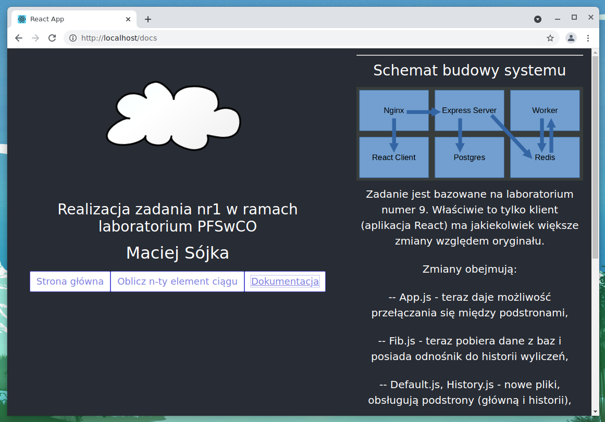

# FibonacciCloud

## Opis projektu

Zadanie jest bazowane na laboratorium numer 9. Właściwie to tylko klient (aplikacja React) ma jakiekolwiek większe zmiany względem oryginału.

### Zmiany obejmują:

* App.js - teraz daje możliwość przełączania się między podstronami,
* Fib.js - teraz pobiera dane z baz i posiada odnośnik do historii wyliczeń,
* Default.js, History.js - nowe pliki, obsługują podstrony (główną i historii),
* Spectre.min.css - lekki szkielet css do utworzenia "layout-u" strony.
* logo.svg - zmiana na (obliczeniową) chmurkę.

## Uruchomienie usługi
W katalogu głównym należy wywołać polecenie:

`COMPOSE_DOCKER_CLI_BUILD=1 DOCKER_BUILDKIT=1 docker compose -f docker-compose.dev.yml up --build`

## Wygląd aplikacji

